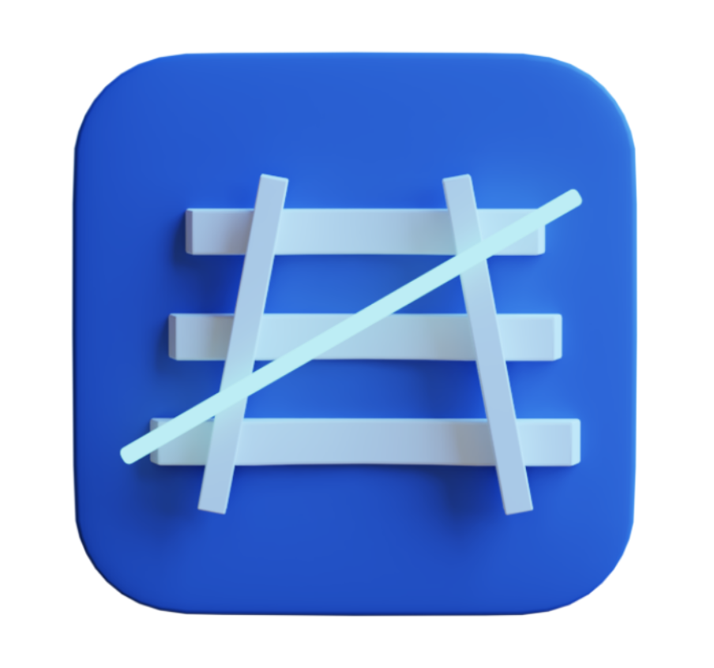
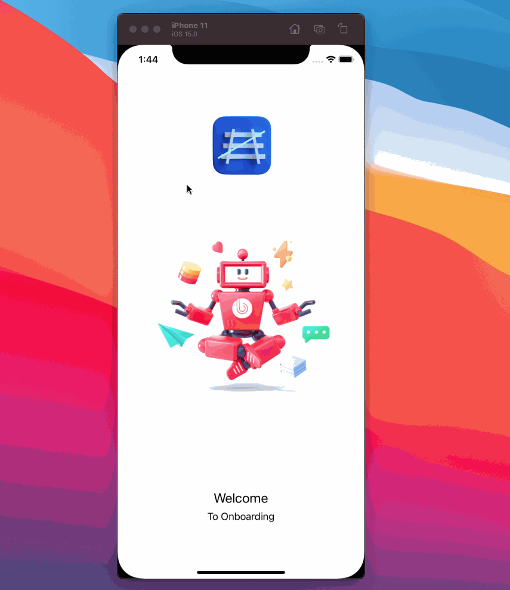

  

 
  

## Overview

- ExecutivePageController is a very flexible and light onboarding for iOS. 📑
* Just add this filese to existing project

## Requirements

- **iOS** 10.0+ 
- Swift 4.0+

## License
ExecutivePageController is released under the MIT license. See [LICENSE](https://github.com/SwifterSwift/SwifterSwift/blob/master/LICENSE) for more information.

